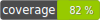

# ISO-3166 country factory



This component provides factory for create country according to ISO-3166 standard by:
- code (alpha2, alpha3, numeric code)
- full english name

Factory creates instance of arslanimamutdinov\ISOStandard3166\Country.

## Installation

```php
composer require rocketfellows/iso-standard-3166-factory
```

## Create Country by code

Note: create by code case-insensitive.

Example create Country by alpha2, alpha3, numeric code:

```php
$factory = new CountryFactory();

$factory->createByCode('AT');   // creates by alpha2 code
$factory->createByCode('at');   // creates by alpha2 code in lower case
$factory->createByCode('AUT');  // creates by alpha3
$factory->createByCode('aut');  // creates by alpha3 in lower case
$factory->createByCode('040');  // creates by numeric code
```

Examples above  will return:

```shell
object(arslanimamutdinov\ISOStandard3166\Country)#3 (4) {
["name":"arslanimamutdinov\ISOStandard3166\Country":private]=>
string(7) "Austria"
["alpha2":"arslanimamutdinov\ISOStandard3166\Country":private]=>
string(2) "AT"
["alpha3":"arslanimamutdinov\ISOStandard3166\Country":private]=>
string(3) "AUT"
["numericCode":"arslanimamutdinov\ISOStandard3166\Country":private]=>
string(3) "040"
}
```

If code is empty or unknown factory will throw:
- EmptyCountryCodeException
- UnknownCountryCodeException

## Create Country by english name

Note: create by code case-sensitive and need full name.

Example create Country by name:

```php
$factory = new CountryFactory();

$factory->createByName('Austria');
```

Examples above  will return:

```shell
object(arslanimamutdinov\ISOStandard3166\Country)#6 (4) {
  ["name":"arslanimamutdinov\ISOStandard3166\Country":private]=>
  string(7) "Austria"
  ["alpha2":"arslanimamutdinov\ISOStandard3166\Country":private]=>
  string(2) "AT"
  ["alpha3":"arslanimamutdinov\ISOStandard3166\Country":private]=>
  string(3) "AUT"
  ["numericCode":"arslanimamutdinov\ISOStandard3166\Country":private]=>
  string(3) "040"
}
```

If name is empty or unknown factory will throw:
- UnknownCountryNameException
- EmptyCountryNameException

## Contributing

Welcome to pull requests. If there is a major changes, first please open an issue for discussion.

Please make sure to update tests as appropriate.
